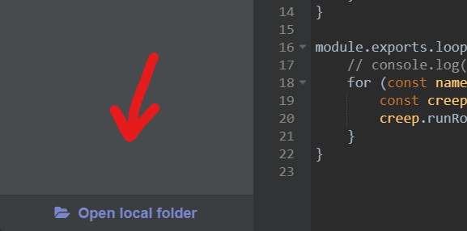

# Screeps Base 👾

This repository contains the **BASE** structure that i use to start screepting 😉


## ⚙️ Setup
- Clone the repository
    ```
    git clone git@github.com:SyNeto/screeps-base.git 
    ```
- Install dependencies
    ```
    npm install
    ```
- Configure your output (rollup.config.js)
    ```js
        ...

        output: {
            file: 'dist/main.js', // <-- Setup here the output
        ...

    ```
    
    To get your destination folder for your steam screeps app project, check in the lower left corner
    for a button labeled as `Open local folder` (Check figure below).

    

- Start screepting 🤖
    ```

    $ npm run build
    ```